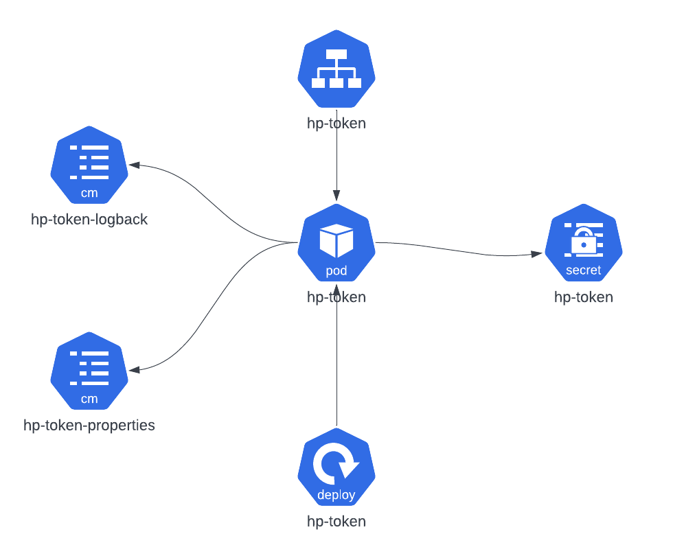

# 3scale-hp-token


This project is a custom police to be used in 3scale through Policy *"Camel-Service"*

> ATTENTION: This policy is intended for use with an HP IDP, which is not an Oauth IDP

Basically, this policy is a proxy that will capture the request, and before calling the backend, it will request a token from an API to then exchange the current token for this new generated token.
This change will occur from the header http ***Authorization***

The project consists of a Red Hat Fuse application using the technologies:

 - Red Hat Fuse 7.11
 - Spring-Boot 2
 - Apache Camel 2.23
 - Open JDK 11
 
## Geração da Imagem

In order to generate the Image, it is first necessary to generate the .JAR through MAVEN 3.6.x

```
mvn clean install
```

Below are the steps to generate the image using podman.

```
podman build -t <IMAGE REGISTRY REPOSITORY>/3scale-hp-token:<TAG> .

podman push <IMAGE REGISTRY REPOSITORY>/3scale-hp-token:<TAG> --tls-verify=false
```

> NOTE: In addition to the Quay credential, you will need to login to the registry
> from Red Hat to download the Red Hat Fuse base image.

```
podman login registry.redhat.io
```

## Deploy no Openshift

The elements are prepared to run in a namespace called 3scale-custom-polices, but can be edited if necessary.

There is a folder in the project called [openshift](./openshift/), containing the yamls files needed to deploy the application.
After generating the application jar package and publishing the image in the quay repository, you can use the command below to deploy the application:
```
oc apply -f <PASTA DO PROJETO/openshift/>
```

> NOTE: Make sure the image is correct in the [./openshift/deployment.yml](./openshift/deployment.yml) file

After deploying the image, the following structure will be created in the namespace:



 - **hp-token-logback (ConfigMap): ** Contém um arquivo com definições de log. Este arquivo deve ser editado para alterar definições como o nível de log a ser salvo.
 - **hp-token-properties (ConfigMap): **  Refere-se ao **arquivo application.properties** com propriedades do spring-boot e camel.
 - **hp-token (Secret): ** Contem as credenciais e a url para solicitação do token.
 - **hp-token (Pod): ** É a instancia da aplicação em execução. Os logs podem ser acessados por ele.
 - **hp-token (Service): ** É o serviço que sera utilizado para acesso entre o 3Scale e o Pod da aplicação
 - **hp-token (Deployment):** Arquivo contendo as definições do POD como por exemplo a imagem a ser utilizada, configmas e secrets. 

## Configurando a policy no 3Scale

Go to this [policy setup procedure](./doc/install-policy.md)


