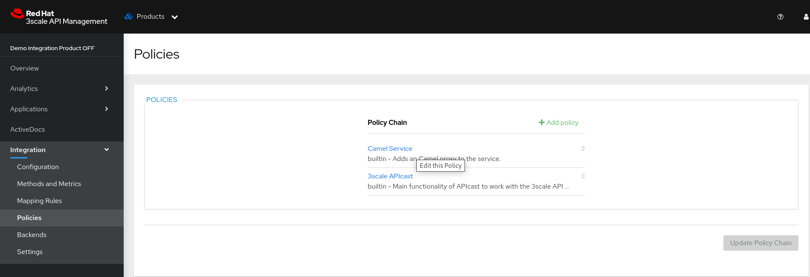
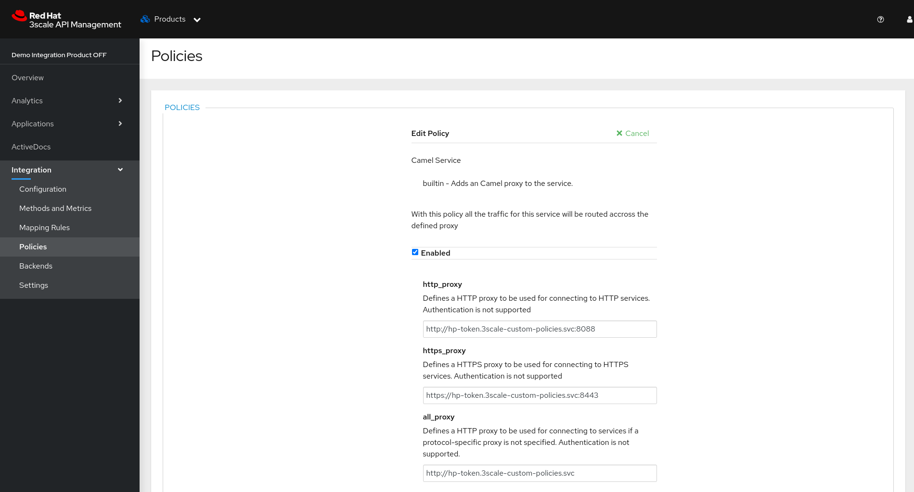

To execute the policy in a **PRODUCT**, access the **Policies** menu in 3Scale and follow the steps below:

- Adicione a policy **Camel Service**

- Clique na policy e configure com o endereço do serviço da custom policy

- ***http_proxy:*** http://hp-token.3scale-custom-policies.svc:8088

- ***https_proxy:*** https://hp-token.3scale-custom-policies.svc:8443

- ***all_proxy:*** http://hp-token.3scale-custom-policies.svc

> The URL is formed according to the following logic:

> [PROTOCOL]://<SERVICE NAME>.<NAMESPACE>.svc:<PORT>